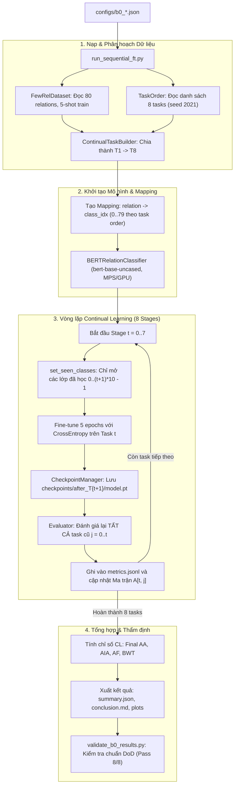

# Research Code Lab

Workspace này dùng để gom source code thử nghiệm phục vụ nghiên cứu trước khi đưa phần ổn định sang source code chính.

## Vai trò

- Thử nghiệm reproduction từ paper.
- Chuẩn hóa dataset và task generation.
- Chạy ablation, baseline, smoke experiment.
- Giữ lại log, manifest, config để có thể tái lập.
- Chỉ promote code sang repo chính khi đã có kết quả và boundary rõ ràng.

## Cấu trúc folder

```text
research-code-lab/
  paper-reproductions/       Code theo từng paper hoặc repo paper gốc đã chỉnh sửa.
  dataset-pipelines/         Pipeline tải, normalize, split task, build benchmark.
  experiments/               Script chạy thử nghiệm, ablation, launch config.
  notebooks/                 Jupyter Notebooks chuẩn hóa chạy trực tiếp trên Google Colab.
  shared/                    Utility dùng chung giữa nhiều thử nghiệm.
  reports/                   Manifest, metric summary, notebook/report đã xuất.
  promote-candidates/        Code đã đủ ổn để chuẩn bị đưa sang source chính.
  docs/                      Ghi chú kỹ thuật về quy ước, dataset, paper protocol.
```

## Google Colab Notebooks

Chạy trực tiếp các benchmark trên Google Colab (GPU T4/V100/A100):

- **Baseline B0 (Sequential Fine-Tuning - Lower Bound):** [](https://colab.research.google.com/github/vinhlq2512/research-code-lab/blob/main/notebooks/b0_sequential_ft.ipynb)
- **Upper Bound (Joint Training - Multitask):** [](https://colab.research.google.com/github/vinhlq2512/research-code-lab/blob/main/notebooks/upper_bound_joint.ipynb)

Xem chi tiết hướng dẫn tại [notebooks/README.md](./notebooks/README.md).


## Subprojects hiện có

- [continual-relation-extraction](./dataset-pipelines/continual-relation-extraction): FewRel/TACRED data pipeline và continual task generation cho các paper continual relation extraction.

## Quy ước làm việc

- Mỗi subproject runnable nên có `README.md`, `pyproject.toml` hoặc file setup tương đương.
- Raw data không commit; giữ trong `data/raw/` của subproject hoặc symlink tới kho dữ liệu local.
- Mọi experiment phải chạy từ config, không hard-code path trong script.
- Output quan trọng cần có manifest hoặc log ghi seed, input hash, command/config.
- Khi chuẩn bị promote, copy hoặc port sang `promote-candidates/` trước, kèm note vì sao code đủ ổn định.

---

## Continual Relation Extraction (CRE) Pipeline & Baseline B0

Hệ thống benchmark và huấn luyện học tăng cường liên tục (Continual Learning) cho trích xuất quan hệ (Relation Extraction), hiện thực hoá đường cơ sở **Baseline B0 (Sequential Fine-Tuning)** trên tập dữ liệu FewRel Track A (8 tasks × 10 relations, 5-shot, seed 2021).

### 1. Cấu trúc thư mục & Vai trò từng thành phần

```text
research-code-lab/
├── configs/                                 # [1] CẤU HÌNH THÍ NGHIỆM
│   └── b0_sequential_ft_fewrel_5shot_...json# Khai báo siêu tham số (seed, shot, backbone, purity rules)
│
├── dataset-pipelines/                       # [2] TIỀN XỬ LÝ & TẠO DỮ LIỆU LIÊN TỤC
│   └── continual-relation-extraction/
│       ├── data/raw/fewrel/                 # Dữ liệu gốc FewRel (train_wiki.json, val_wiki.json, pid2name.json)
│       ├── task-orders/fewrel/              # Thứ tự các task (order_seed_2021.json: 8 task × 10 relations)
│       └── src/
│           ├── datasets/                    # Bộ nạp dữ liệu: fewrel.py, tacred.py, base.py
│           ├── schemas/relation_sample.py   # Định nghĩa chuẩn dữ liệu RelationSample ([start, end) spans)
│           ├── task_generation/             # Chia task rời rạc: task_builder.py, task_order.py
│           └── evaluation/                  # Đánh giá: evaluator.py, performance_matrix.py, metrics.py
│
├── experiments/                             # [3] MÃ NGUỒN HUẤN LUYỆN & KIỂM ĐỊNH
│   ├── run_sequential_ft.py                 # File thực thi chính (Entry Point) của baseline B0
│   ├── validate_b0_results.py               # Bộ thẩm định nghiêm ngặt Definition of Done (DoD)
│   ├── registry.yaml                        # Sổ đăng ký thí nghiệm tập trung (ID, metadata, trạng thái)
│   └── continual-relation-baselines/        # Package lõi cl_re_baselines
│       └── src/cl_re_baselines/
│           ├── model.py                     # Mô hình BERTRelationClassifier (Entity Markers, Global Head)
│           ├── data_loader.py               # Chèn token đặc biệt ([E1], [/E1], [E2], [/E2])
│           ├── sequential_trainer.py        # Vòng lặp Continual Learning qua các stage T1 -> T8
│           ├── checkpoint.py                # Quản lý lưu/nạp trọng số (model.pt ~418MB mỗi stage)
│           ├── logger.py                    # Ghi log tức thời (metrics.jsonl) & tổng hợp (summary.json)
│           └── plotting.py                  # Vẽ biểu đồ forgetting_curve và accuracy_over_tasks
│
└── results/                                 # [4] KẾT QUẢ ĐẦU RA CỦA THÍ NGHIỆM
    └── fewrel/5shot/B0_sequential_ft/seed_2021/
        ├── checkpoints/after_T1..T8/        # Checkpoint model.pt và metadata của từng task
        ├── plots/                           # Biểu đồ suy giảm hiệu năng dạng PNG/SVG
        ├── performance_matrix.csv / .json   # Ma trận hiệu năng tam giác dưới A[t, j]
        ├── metrics.jsonl                    # Log chi tiết từng bước đánh giá
        ├── summary.json                     # Chỉ số tổng kết: Final AA, AIA, AF, BWT
        └── conclusion.md                    # Báo cáo tổng kết tự động
```

### 2. Chi tiết vai trò các file then chốt

| Thư mục / File | Vai trò cốt lõi trong hệ thống |
| :--- | :--- |
| **`configs/*.json`** | Bản hợp đồng thiết lập thí nghiệm. Quy định tính thuần khiết (**Purity**): không replay dữ liệu cũ ($M=0$), không prompt, không prototype, không KD. |
| **`relation_sample.py`** | Chuẩn hoá cấu trúc mẫu dữ liệu thống nhất (`sample_id`, `tokens`, span thực thể `head`/`tail`, `relation`, `relation_id`). |
| **`task_builder.py`** | Chia toàn bộ 80 quan hệ thành 8 task rời rạc không giao thoa (**Disjoint**), mỗi task đúng 10 quan hệ theo thứ tự ngẫu nhiên cố định bởi seed. |
| **`model.py`** | Đóng gói mô hình `bert-base-uncased`: chèn Entity Markers, trích xuất biểu diễn thực thể $[h_{e1}; h_{e2}]$, qua phân loại 80 lớp và **mặt nạ che lớp chưa học (Class Masking)**. |
| **`sequential_trainer.py`** | Điều phối quá trình huấn luyện tuần tự: học task $t \to$ lưu checkpoint $\to$ đánh giá lại toàn bộ các task cũ từ $0 \dots t$. |
| **`performance_matrix.py`** | Xây dựng và tính toán ma trận tam giác dưới $A_{t, j}$ (độ chính xác của task $j$ sau khi học xong task $t$), từ đó tính mức độ quên lãng (**Catastrophic Forgetting**). |
| **`validate_b0_results.py`** | Công cụ kiểm tra độc lập tự động (DoD Validator): duyệt 8 tiêu chí kiểm tra dữ liệu, ma trận 36 ô, file `model.pt` thật (> 10MB), không chấp nhận dữ liệu giả lập. |

### 3. Luồng chạy từ A đến Z (Execution Pipeline)



### 4. Các cơ chế kỹ thuật quan trọng

1. **Entity Marker Representation (Biểu diễn thực thể)**:
   - Văn bản gốc được chèn thêm 4 token đặc biệt: `[E1]`, `[/E1]` bao quanh chủ thể (head) và `[E2]`, `[/E2]` bao quanh đối tượng (tail).
   - BERT mã hoá toàn bộ câu, trích xuất vector ẩn tại vị trí `[E1]` và `[E2]` ghép lại thành $h_{\text{rep}} = [h_{e1}; h_{e2}] \in \mathbb{R}^{1536}$. Vector này được đưa qua tầng `nn.Linear(1536, 80)` để tính logits phân loại.

2. **Continual Class Masking (Mặt nạ che nhãn)**:
   - Đầu ra của bộ phân loại cố định 80 lớp.
   - Khi ở Task 1 (10 quan hệ đầu), các logits từ index 10 đến 79 được gán $-10^9$ (che đi).
   - Khi sang Task 2, mở thêm 10 lớp tiếp theo (active 0..19), các lớp 20..79 tiếp tục bị che.
   - Đảm bảo mô hình không bao giờ dự đoán nhãn của các task trong tương lai.

3. **Đo đạc Catastrophic Forgetting (Ma trận $A_{t, j}$)**:
   - Sau khi học xong task $t$, mô hình được đánh giá trên toàn bộ $j \in \{0, \dots, t\}$.
   - Độ suy giảm (Forgetting) của Task $j$ sau khi kết thúc toàn bộ thí nghiệm:
     $$f_j = \max_{k \in \{j, \dots, T-1\}} A_{k, j} - A_{T-1, j}$$
   - Baseline B0 không có bộ nhớ đệm ($M=0$) giúp đo lường chính xác mức độ quên lãng tự nhiên của mô hình để làm chuẩn so sánh cho các phương pháp sau này.
